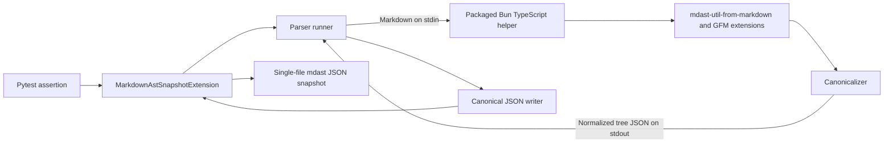

# syrupy-mdast technical design

## Preamble

- **Status:** Proposed living design.
- **Scope:** The first stable AST-aware Markdown snapshot contract.
- **Audience:** Maintainers, implementers, and reviewers of `syrupy-mdast`.
- **Companion document:** [Development roadmap](roadmap.md).
- **Last updated:** 2026-07-10.

This document defines the target architecture. Accepted Architecture Decision
Records (ADRs), if added, take precedence over this design where they conflict.

## 1. Problem and design intent

Raw Markdown snapshots report changes to delimiters, wrapping, and source
positions even when the parsed document structure remains the same. Such noise
trains reviewers to accept broad snapshot updates and makes meaningful changes
harder to identify.

`syrupy-mdast` compares a canonical Markdown Abstract Syntax Tree (mdast)
instead. The extension parses a Markdown string, removes location metadata,
normalizes only explicitly harmless representation details, and stores the
result as readable JSON. The comparison is structural, not rendered: two
documents compare equally when they produce the same canonical mdast tree.

The extension uses `mdast-util-from-markdown` directly. That utility converts
Markdown to mdast and accepts micromark and mdast extensions without requiring
the broader remark processor pipeline.[^1] Syrupy's single-file extension
already supplies the storage, update, deletion, and diff lifecycle needed by a
format-specific serializer.[^2]

## 2. Goals, non-goals, and constraints

### 2.1. Goals

- Treat delimiter spelling, source positions, and input line-ending style as
  non-semantic.
- Preserve Markdown distinctions that can affect document meaning or rendered
  output, including hard breaks, code whitespace, list structure, table
  alignment, references, and raw HTML.
- Produce deterministic, reviewable `.mdast.json` snapshots on every supported
  platform.
- Support CommonMark plus GitHub Flavoured Markdown (GFM) in the first stable
  parser profile.
- Fail with bounded, actionable diagnostics when the Bun runtime or
  parser cannot complete the request.
- Keep the public Python API narrow and fully typed.

### 2.2. Non-goals

- Proving that two Markdown documents render to identical Hypertext Markup
  Language (HTML).
- Parsing raw HTML nodes into a Hypertext Abstract Syntax Tree (hast).
- Collapsing text whitespace or rewriting reference identifiers.
- Mirroring arbitrary remark plugin pipelines.
- Exposing user-defined normalizers or parser extension combinations in v1.
- Comparing pre-built mdast objects supplied by callers.

### 2.3. Constraints

The Python package supports Python 3.12 and later. Its runtime dependency range
must name compatible Syrupy releases rather than depending on an unbounded
extension API. The TypeScript entrypoint targets supported Bun releases; the
exact minimum version belongs in package metadata and the user guide.

Snapshot comparison must not access the network. Release artefacts contain the
parser source, manifest, and lockfile. Consumers install dependencies in a
separate setup step; serialization never invokes `bun install`.

## 3. Prior art and technology choices

Syrupy permits a test to select an `extension_class` directly or through
`snapshot.with_defaults(...)`. `SingleFileSnapshotExtension` stores one
serialized value per file and supports text output, making it the closest
existing abstraction.[^2] The extension subclasses that type rather than
reimplementing Syrupy's snapshot lifecycle.

`mdast-util-from-markdown` is preferable to remark because the product needs
parsing, not a processor with plugins and transformation phases. The GFM
profile combines `micromark-extension-gfm` with `mdast-util-gfm`; the latter
documents support for autolink literals, footnotes, strikethrough, tables, and
task lists.[^3]

A Python-native Markdown parser would remove the cross-runtime boundary but
would define a different tree contract. mdast has a published node model, a
typed extension ecosystem, and a direct GFM integration. Comparing rendered
HTML would erase useful Markdown structure and introduce renderer policy.

The design follows `simulacat`'s mixed Python and Bun packaging boundary: the
wheel contains a TypeScript entrypoint, `package.json`, and `bun.lock`, Python
resolves those assets with `importlib.resources`, and a module command installs
the locked JavaScript dependencies.[^5]

The design uses a short-lived Bun process per serialization. A persistent
worker could reduce process-start cost, but it would add lifecycle,
cancellation, and pytest-xdist coordination risks before measurements show a
need.

## 4. Terminology and comparison contract

| Term                         | Normative meaning                                                                       |
| ---------------------------- | --------------------------------------------------------------------------------------- |
| Canonical tree               | An mdast tree after the v1 normalization policy has run.                                |
| Parser profile               | The fixed syntax set accepted by a release; v1 is CommonMark plus GFM.                  |
| Representational distinction | A source difference deliberately removed because it does not change the canonical tree. |
| Semantic distinction         | A parsed mdast field or ordering difference retained in the canonical tree.             |
| Snapshot payload             | UTF-8 JSON written by the Python canonical writer.                                      |

_Table 1: Normative terminology._

Two inputs are equivalent precisely when the same package version and parser
profile produce byte-identical snapshot payloads. This is a versioned
structural contract, not a claim of universal Markdown equivalence. Parser or
normalization changes that alter existing payloads require release notes and a
declared snapshot migration.

## 5. Architecture

The Python extension owns the public API, process boundary, protocol
validation, error translation, and final JSON serialization. A packaged
TypeScript module owns Markdown parsing and tree normalization. Standard input
and standard output form a deliberately small port between them.

The following diagram shows the complete assertion path.



_Figure 1: Markdown assertion data flow._

The process boundary keeps TypeScript dependencies out of Python's import
graph. It also makes failure containment explicit: a parser crash cannot leave
partially mutated Python state, and a timeout can terminate the child process.

## 6. Public Python interface

The package exports these public names:

```python
from syrupy_mdast import MarkdownAstError, MarkdownAstSnapshotExtension
```

`MarkdownAstSnapshotExtension` accepts only `str` values and subclasses
`SingleFileSnapshotExtension`. It sets `file_extension = "mdast.json"` and uses
Syrupy's text write mode. Non-string inputs raise `TypeError` before any
process starts.

Callers select the extension through Syrupy's existing API:

```python
import pytest
from syrupy.assertion import SnapshotAssertion

from syrupy_mdast import MarkdownAstSnapshotExtension


@pytest.fixture
def snapshot_markdown_ast(snapshot: SnapshotAssertion) -> SnapshotAssertion:
    """Return a snapshot assertion that compares canonical mdast JSON.

    Example
    -------
    ``assert "# Title" == snapshot_markdown_ast`` stores a heading node
    without source positions.
    """
    return snapshot.with_defaults(extension_class=MarkdownAstSnapshotExtension)
```

Syrupy passes `exclude`, `include`, and `matcher` to serializers. Those options
describe traversal of Python object properties and have no defined meaning for
a source string parsed in another process. The extension rejects any non-`None`
value with `ValueError`; silently ignoring them would make tests appear more
selective than they are.

`MarkdownAstError` is the base for environment, execution, protocol, and parse
failures. Subclasses remain public so consumers can assert a failure category,
but messages are not a stable API. Wrong Python input types continue to use
`TypeError` rather than the domain hierarchy.

## 7. Parser profile and TypeScript packaging

The v1 parser profile enables the mdast core syntax plus all GFM constructs.
GFM requires both its micromark tokenizer extension and its mdast conversion
extension.[^3] Frontmatter, math, directives, and Markdown JSX (MDX) remain
outside the profile even though the parser ecosystem can add them.

The repository keeps the TypeScript entrypoint under
`src/markdown-to-mdast.ts`, with `package.json` and `bun.lock` at its root.
Hatch force-includes those files as `syrupy_mdast/src/markdown-to-mdast.ts`,
`syrupy_mdast/package.json`, and `syrupy_mdast/bun.lock` in wheels. This
matches the installed-asset layout proven by `simulacat`.[^5]

`parser_entrypoint()` uses `importlib.resources.files("syrupy_mdast")` to find
the installed entrypoint and falls back to the repository path for editable
development. `parser_package_root()` searches the known parents for the
manifest. A stable `python -m syrupy_mdast.js_root` command prints that root
for shell and Continuous Integration (CI) use.

`python -m syrupy_mdast.install_parser_deps` runs
`bun install --cwd <package-root>` with explicit arguments, a bounded timeout,
and the packaged lockfile. Installation errors use the same environment error
hierarchy as serialization. The user guide makes this step a prerequisite; the
extension never installs dependencies implicitly.

At runtime, the runner uses `BUN` when explicitly configured or `bun` from
`PATH`, validates the resolved executable, and invokes it with an argument
sequence and `shell=False`. Python documents argument sequences as the normal
subprocess interface and recommends `run()` for captured output.[^4] The
extension never searches the project directory for an executable.

## 8. Canonicalization contract

Canonicalization walks every array element and object value recursively. It
applies only these transformations:

1. Remove every object member named `position`.
2. Remove a `data` member only when its value is an empty plain object.
3. Normalize carriage-return line feed and bare carriage return to line feed
   in every string value.
4. Emit object members in the preferred mdast order below, followed by unknown
   members in Unicode code-point order.

The preferred order is `type`, structural scalar fields, link and reference
fields, `value`, `data`, and `children`. The implementation defines the exact
field sequence as one immutable constant covered by a contract fixture.
Object-member order improves reviewability but does not change array order.

The canonicalizer preserves `null`, `false`, `0`, empty arrays, non-empty
`data`, and all unknown fields. Preserving unknown fields prevents a newer
parser node from disappearing merely because the Python package does not know
its schema.

The Bun helper emits one JSON value and a trailing newline. Python parses that
output, requires a root object with `type == "root"` and a `children` array,
then writes UTF-8 JSON with two-space indentation, unescaped Unicode, and one
final newline. A representative payload is:

```json
{
  "type": "root",
  "children": [
    {
      "type": "heading",
      "depth": 1,
      "children": [
        {
          "type": "text",
          "value": "Hello"
        }
      ]
    }
  ]
}
```

No rule collapses text whitespace. Markdown whitespace affects hard breaks,
inline code, tables, and HTML, so a general whitespace rewrite cannot meet the
preservation contract.

## 9. Execution and failure semantics

The runner calls `subprocess.run` with text input, captured output,
`check=False`, `shell=False`, a fixed encoding, and a documented timeout. It
passes no caller-controlled arguments. Python notes that timeout expiry may
occur after process creation itself, so the timeout is a bound on child
execution rather than a strict wall-clock guarantee.[^4]

| Failure                                | Public category               | Diagnostic content                                            |
| -------------------------------------- | ----------------------------- | ------------------------------------------------------------- |
| Bun is absent or unsupported           | `MarkdownAstEnvironmentError` | Required and detected versions, without the full environment. |
| Parser dependencies are absent         | `MarkdownAstEnvironmentError` | Dependency-install command and resolved package root.         |
| Process cannot start or times out      | `MarkdownAstExecutionError`   | Executable path, timeout category, and remediation.           |
| Parser rejects input or exits non-zero | `MarkdownAstParseError`       | Bounded standard error and exit status.                       |
| Output is not one valid protocol value | `MarkdownAstProtocolError`    | Protocol expectation and a bounded output excerpt.            |

_Table 2: Failure categories and diagnostics._

Diagnostics cap captured standard error and output excerpts by character count.
They do not include the source Markdown unless the parser already reported a
bounded excerpt. The runner rejects successful processes that emit
non-whitespace data after the JSON value.

## 10. Snapshot storage and concurrency

Each assertion uses Syrupy's single-file naming rules and the compound extension
`.mdast.json`. Syrupy retains responsibility for discovery, update, deletion,
and textual diff reporting.[^2] The extension supplies only the serialized
string.

The serializer holds no mutable global state. Each call creates a separate
child process, so pytest-xdist workers cannot share parser state or interleave
protocol streams. Syrupy remains responsible for coordinating snapshot writes;
this package must verify its behaviour against the supported Syrupy range.

## 11. Correctness and verification

The implementation must demonstrate these properties:

| Property                | Verification method                                                                                                    | Boundary and limitation                                  |
| ----------------------- | ---------------------------------------------------------------------------------------------------------------------- | -------------------------------------------------------- |
| Idempotence             | Property-based tests run canonicalization twice over generated JSON trees.                                             | Covers normalization, not Markdown parsing.              |
| Position invariance     | Generate valid trees with arbitrary nested `position` members and compare canonical output.                            | Does not prove future fields are non-positional.         |
| Line-ending invariance  | Generate strings containing LF, CRLF, and CR variants and compare output.                                              | Does not collapse other Unicode line separators.         |
| Preservation            | Focused fixtures change hard breaks, code whitespace, list order, table alignment, references, and HTML independently. | Covers named high-risk constructs, not every renderer.   |
| Syntax equivalence      | Paired Markdown fixtures such as `*x*` and `_x_` must produce identical payloads.                                      | Equivalence is limited to the fixed parser profile.      |
| Cross-runtime integrity | End-to-end tests execute the packaged TypeScript entrypoint through the Python extension.                              | Requires Bun and does not validate unsupported runtimes. |

_Table 3: Correctness properties and verification boundaries._

The end-to-end matrix covers CommonMark and GFM inputs, three line-ending
styles, success and each failure category, source-tree and installed-wheel
execution, and serial versus xdist pytest runs. Pairwise selection may reduce
the matrix only after mandatory combinations cover installed-wheel execution,
GFM tables, parser timeout, malformed output, and concurrent assertions.

Parser conformance remains upstream's responsibility. This project verifies the
selected profile, normalization policy, package boundary, and observable Syrupy
behaviour.

## 12. Security and resource limits

Markdown is untrusted data. The parser receives it only through standard input;
the runner never interpolates it into arguments, paths, environment variables,
or shell text. The helper performs no file, network, or dynamic module access
after startup.

The timeout limits non-terminating parses. The runner also rejects inputs above
a documented byte limit before process creation and caps captured diagnostics.
The initial limit must be generous enough for repository documentation and
configurable only through an explicit future contract; an undocumented
environment variable would make snapshots machine-dependent.

The lockfile, licence inventory, and dependency audit make the shipped
TypeScript dependency graph reviewable. They do not replace release-signing
controls.

## 13. Compatibility, distribution, and migration

The wheel declares Syrupy as a Python runtime dependency and includes the
TypeScript entrypoint, manifest, and lockfile as package data. Bun remains an
external executable because embedding a runtime would multiply wheel size and
platform-specific release work. The user guide states the supported Bun
versions, dependency-install command, and a preflight example.

The package validates Bun before the first parse in each process and caches
only the immutable resolved executable and version. Tests can inject a runner
through an internal protocol; the public extension constructor does not expose
process configuration.

The snapshot format version follows the package's semantic versioning:

- Patch releases do not intentionally change canonical payloads.
- Minor releases may add syntax that previously failed, but must not reinterpret
  existing accepted input without an announced migration.
- Major releases may change the parser profile or normalization contract and
  must document expected snapshot churn.

## 14. Alternatives rejected

| Alternative                         | Reason rejected for v1                                                                                 |
| ----------------------------------- | ------------------------------------------------------------------------------------------------------ |
| Raw Markdown snapshots              | Preserve irrelevant delimiter and wrapping changes.                                                    |
| Full remark processor               | Adds transformation machinery without a required pipeline to mirror.                                   |
| Python-native Markdown tree         | Does not provide the selected mdast and GFM contract.                                                  |
| hast or rendered HTML comparison    | Erases Markdown structure and introduces renderer policy.                                              |
| Generated JavaScript bundle         | Diverges from the established `simulacat` source-and-lockfile model and adds generated-artefact drift. |
| Implicit dependency installation    | Makes assertions mutate installed package state and potentially access the network.                    |
| Persistent parser worker            | Adds lifecycle and concurrency complexity without measured need.                                       |
| Aggressive whitespace normalization | Can erase meaningful Markdown distinctions.                                                            |

_Table 4: Rejected alternatives._

## 15. Risks and deferred decisions

The external Bun requirement and explicit dependency installation are the
largest adoption costs. Installed-wheel tests and environment diagnostics
reduce surprise but cannot remove that cost. Parser upgrades can cause broad
snapshot churn, so dependency updates require a fixture-corpus diff and
explicit classification before merge. Process startup may dominate small
snapshots; benchmarking must precede any persistent worker design.

The following capabilities are deferred:

- opt-in frontmatter, math, directive, and MDX profiles;
- policy switches such as ignored table alignment or normalized reference
  labels;
- hast normalization for embedded HTML;
- persistent or pooled parser processes; and
- caller-supplied parser plugins.

Each deferred capability changes the comparison contract or interaction surface
and therefore requires a design update, compatibility policy, and combinatorial
coverage plan.

## 16. Acceptance criteria

The first stable implementation is acceptable when:

- the public extension compares documented syntax-equivalent Markdown as equal
  while detecting every named preservation distinction;
- source-tree and installed-wheel tests execute their packaged parser assets
  without network access during serialization;
- all failure categories produce bounded diagnostics and no shell is invoked;
- the canonicalization properties pass their generated and fixture-based
  verification;
- the mandatory end-to-end combinations pass under supported Python, Syrupy,
  Bun, and pytest-xdist versions; and
- the user and developer guides describe installation, usage, parser-profile
  scope, packaged-asset maintenance, and migration behaviour.

## 17. References

[^1]: [`mdast-util-from-markdown` documentation](https://github.com/syntax-tree/mdast-util-from-markdown),
      accessed 2026-07-10.
[^2]: [Syrupy repository and extension documentation](https://github.com/syrupy-project/syrupy),
      accessed 2026-07-10.
[^3]: [`mdast-util-gfm` documentation](https://github.com/syntax-tree/mdast-util-gfm),
      accessed 2026-07-10.
[^4]: [Python `subprocess` documentation](https://docs.python.org/3/library/subprocess.html),
      accessed 2026-07-10.
[^5]: [`leynos/simulacat` mixed Python and Bun packaging approach](https://github.com/leynos/simulacat),
      accessed 2026-07-10.
