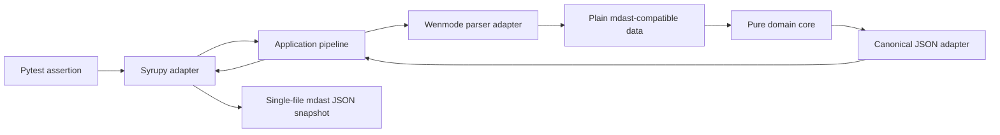

# syrupy-mdast technical design

## Preamble

- **Status:** Proposed living design.
- **Scope:** The first stable AST-aware Markdown snapshot contract.
- **Audience:** Maintainers, implementers, and reviewers of `syrupy-mdast`.
- **Companion document:** [Development roadmap](roadmap.md).
- **Last updated:** 2026-07-28.

This document defines the target architecture. Accepted Architecture Decision
Records (ADRs), if added, take precedence where they conflict with this design.

## 1. Problem and design intent

Raw Markdown snapshots report changes to delimiters, wrapping, and source
positions even when the interpreted document structure remains the same. Such
noise trains reviewers to accept broad snapshot updates and makes meaningful
changes harder to identify.

`syrupy-mdast` compares a canonical, mdast-compatible Abstract Syntax Tree
(AST) instead. The extension parses a Markdown string with Wenmode's GitHub
profile, removes location metadata defensively, normalizes only explicitly
harmless representation details, and stores readable JSON. The comparison is
structural, not rendered: two documents compare equally when the supported
parser and canonicalizer produce the same payload.

Wenmode is a dependency-free Python Markdown parser whose public `to_ast()`
interface emits mdast-compatible data.[^1] Its GitHub profile extends
CommonMark with tables, strikethrough, task lists, extended autolinks, and
footnotes.[^2] Syrupy's single-file extension supplies the storage, update,
deletion, and diff lifecycle required by a format-specific serializer.[^3]

## 2. Goals, non-goals, and constraints

### 2.1. Goals

- Treat delimiter spelling, source positions, input line endings, and ordinary
  link-reference notation as non-semantic.
- Preserve Markdown distinctions that can affect interpreted structure or
  rendered output, including hard breaks, code whitespace, list structure,
  table alignment, footnotes, and raw HTML.
- Produce deterministic, reviewable `.mdast.json` snapshots on every supported
  platform.
- Support CommonMark plus GitHub Flavoured Markdown (GFM), including GFM
  footnotes, through Wenmode's GitHub profile.
- Operate entirely within the Python package and process.
- Keep the public Python API narrow and fully typed.

### 2.2. Non-goals

- Producing byte-compatible output with unified, remark, or
  `mdast-util-from-markdown`.
- Preserving ordinary reference-link syntax, unused ordinary definitions, or
  the placement and spelling of those definitions.
- Proving that two Markdown documents render to identical Hypertext Markup
  Language (HTML).
- Parsing raw HTML nodes into a Hypertext Abstract Syntax Tree (hast).
- Collapsing text whitespace or rewriting footnote identifiers.
- Exposing user-defined normalizers or parser profiles in v1.
- Comparing pre-built AST objects supplied by callers.
- Providing process isolation or a hard wall-clock timeout for hostile input.

### 2.3. Constraints

The Python package supports Python 3.12 and later. Its runtime dependencies
name compatible Syrupy releases and pin the Wenmode release that defines the
snapshot format. Every Wenmode upgrade is reviewed as a potential snapshot
migration.

Snapshot comparison does not access the network, create child processes, or
load project-local parser code. The wheel contains only Python package assets;
consumers do not need Bun, Node.js, TypeScript, JavaScript manifests, or
JavaScript package installation.

## 3. Prior art and technology choices

Syrupy permits a test to select an `extension_class` directly or through
`snapshot.with_defaults(...)`. `SingleFileSnapshotExtension` stores one
serialized value per file and supports text output, making it the closest
existing abstraction.[^3] The extension subclasses that type rather than
reimplementing Syrupy's snapshot lifecycle.

Wenmode is selected because it keeps parsing, canonicalization, packaging, and
failure handling within Python. Its `Parser` objects are reusable, while each
parse receives fresh document state for references and footnotes.[^4] The
package nevertheless creates one parser per adapter call rather than depending
on undocumented shared-instance thread or re-entrant safety. pytest-xdist
workers naturally follow the same per-call rule in separate processes.

The GitHub profile is normative rather than a convenient preset. It provides
the required GFM constructs and applies Wenmode's GitHub HTML policy.[^2] A
custom profile that merely resembles it could drift in footnote, reference, or
HTML behaviour and therefore does not satisfy v1.

Wenmode describes its output as mdast-compatible, not identical to unified's
mdast output. That distinction is part of the product contract. In particular,
ordinary references are resolved, nullable fields are omitted, and Wenmode's
GitHub HTML decisions are retained. These semantics better serve a snapshot
extension intended to suppress source-notation noise.

## 4. Terminology and comparison contract

| Term                         | Normative meaning                                                                       |
| ---------------------------- | --------------------------------------------------------------------------------------- |
| Canonical tree               | Wenmode `to_ast()` data after the v1 normalization policy has run.                      |
| Parser profile               | The fixed syntax and parsing policy; v1 is Wenmode's GitHub profile.                    |
| Representational distinction | A source difference deliberately removed because it does not change the canonical tree. |
| Structural distinction       | A parsed field or array-order difference retained in the canonical tree.                |
| Snapshot payload             | UTF-8 JSON written by the Python canonical writer.                                      |

_Table 1: Normative terminology._

Two inputs are equivalent precisely when the same package version and parser
profile produce byte-identical snapshot payloads. This is a versioned
Wenmode-native structural contract, not a claim of universal Markdown
equivalence or unified mdast interoperability. Parser or normalization changes
that alter existing payloads require release notes and a declared migration.

## 5. Architecture

The package separates the comparison domain from its infrastructure adapters.
The dependency-free domain core owns `MarkdownAstError`, AST-shape validation,
and canonicalization over plain JSON-compatible Python values. It imports
neither Wenmode nor Syrupy and performs no snapshot lifecycle or JSON I/O.

Three narrow adapters surround that core:

- the Wenmode adapter parses Markdown with the fixed GitHub profile and returns
  plain Python data;
- the canonical JSON adapter serializes a validated canonical tree; and
- the Syrupy adapter implements `MarkdownAstSnapshotExtension` and delegates
  snapshot storage, update, deletion, and diff lifecycle to Syrupy.

An internal application pipeline coordinates those adapters with the domain
core and translates documented adapter failures into domain errors. These are
concrete function and module seams, not generic parser or serializer
interfaces: v1 has one supported implementation of each, so abstract ports
would add indirection without a second implementation to justify it.


```mermaid
flowchart LR
    Test[Pytest assertion] --> SyrupyAdapter[Syrupy adapter]
    SyrupyAdapter --> Pipeline[Application pipeline]
    Pipeline --> WenmodeAdapter[Wenmode parser adapter]
    WenmodeAdapter --> Ast[Plain mdast-compatible data]
    Ast --> Domain[Pure domain core]
    Domain --> JsonAdapter[Canonical JSON adapter]
    JsonAdapter --> Pipeline
    Pipeline --> SyrupyAdapter
    SyrupyAdapter --> Snapshot[Single-file mdast JSON snapshot]
```

_Figure 1: Markdown assertion data flow._

This design deliberately favours a small in-process boundary for
repository-controlled Markdown. It gives up the killable child process of the
earlier Bun design. If hostile Markdown and a hard timeout later become product
requirements, a separately designed Python worker may contain Wenmode without
introducing a JavaScript runtime.

Domain tests call validation and canonicalization directly with plain Python
trees and import no Wenmode or Syrupy modules. Adapter tests cover Wenmode
profile behaviour, canonical JSON bytes, and Syrupy lifecycle independently;
end-to-end tests prove the default pipeline wiring. An architecture test
rejects Wenmode or Syrupy imports from the domain core, so infrastructure
dependencies cannot migrate inward unnoticed.

## 6. Public Python interface

The package exports these public names:

```python
from syrupy_mdast import MarkdownAstError, MarkdownAstSnapshotExtension
```

`MarkdownAstSnapshotExtension` accepts only `str` values and subclasses
`SingleFileSnapshotExtension`. It uses Syrupy's concrete single-file hooks:

```python
from syrupy.extensions.single_file import SingleFileSnapshotExtension, WriteMode


class MarkdownAstSnapshotExtension(SingleFileSnapshotExtension):
    file_extension = "mdast.json"
    _write_mode = WriteMode.TEXT
```

`file_extension` is deliberately not `_file_extension`: the supported Syrupy
API reads the public class attribute when constructing snapshot paths.
Non-string inputs raise `TypeError` before parsing.

Callers select the extension through Syrupy's existing API:

```python
import pytest
from syrupy.assertion import SnapshotAssertion

from syrupy_mdast import MarkdownAstSnapshotExtension


@pytest.fixture
def snapshot_markdown_ast(snapshot: SnapshotAssertion) -> SnapshotAssertion:
    """Return an assertion that compares canonical Markdown AST JSON.

    Example
    -------
    ``assert "# Title" == snapshot_markdown_ast`` stores a heading node
    without source positions.
    """
    return snapshot.with_defaults(extension_class=MarkdownAstSnapshotExtension)
```

Syrupy passes `exclude`, `include`, and `matcher` to serializers. Those options
describe traversal of Python object properties and have no defined meaning for
a Markdown source string. The extension rejects any non-`None` value with
`ValueError`; silently ignoring them would make tests appear more selective
than they are.

`MarkdownAstError` is defined in the dependency-free domain core and covers
parser, canonicalization, and serialization failures after application-level
translation. Messages are not a stable API. Wrong Python input types continue
to use `TypeError` rather than the domain hierarchy. The initial public
hierarchy has no environment, execution, or protocol errors because v1 has no
external runtime or child process.

## 7. Parser profile and dependency policy

The v1 parser profile is constructed exactly as follows:

```python
from typing import Any

from wenmode import Parser
from wenmode.presets import github


def parse_markdown(source: str) -> dict[str, Any]:
    """Parse Markdown into Wenmode's mdast-compatible AST.

    Example
    -------
    ``parse_markdown("# Title")`` returns a root containing a depth-one
    heading.
    """
    return Parser(github, positions=False).parse(source).to_ast()
```

This function is the Wenmode adapter seam. The production implementation may
narrow its return type after inspecting Wenmode's published annotations. It
must not wrap the parser behind a generic backend abstraction until a second
supported backend creates a real reuse case.

The GitHub profile extends the CommonMark preset and enables tables,
strikethrough, task lists, extended autolinks, and footnotes.[^2] It also
inherits CommonMark reference links and images and applies the GitHub
disallowed-HTML policy.[^5] Frontmatter, math, directives, and Markdown JSX
(MDX) remain outside v1.

Wenmode is pinned exactly because its AST is the snapshot format. A dependency
update must run the canonical corpus through both versions and classify every
payload change before merge. No JavaScript implementation or package is a
runtime, build, test, or release dependency. A temporary differential test may
use `mdast-util-from-markdown` as a development oracle while evaluating the
initial corpus, but it must be optional, unshipped, and absent from normal CI.

## 8. Canonicalization contract

Wenmode's `to_ast()` result is the canonicalization input. The canonicalizer
walks every array element and object value recursively and applies only these
transformations:

1. Remove every object member named `position`, even though positions are
   disabled in the parser.
2. Remove a `data` member only when its value is an empty plain object.
3. Normalize carriage-return line feed and bare carriage return to line feed
   in every string value.
4. Emit object members in the preferred order below, followed by unknown
   members in Unicode code-point order.

The preferred order is `type`, structural scalar fields, link and footnote
fields, `value`, `data`, and `children`. The implementation defines the exact
field sequence as one immutable constant covered by a contract fixture.
Object-member order improves reviewability but does not change array order.

The canonicalizer preserves `false`, `0`, empty arrays, empty strings, non-empty
`data`, and all unknown fields. Wenmode omits fields whose value is `None`; v1
preserves that omission and does not synthesize schema-specific `null` members.
This makes Wenmode's public AST shape the source of truth rather than
maintaining a partial Python copy of another mdast schema.

Ordinary reference-style links and images are resolved to `link` and `image`
nodes. Their definition nodes, labels, reference forms, and unused definitions
do not appear in snapshots. Direct and reference-style links therefore compare
equally when their resolved children, destination, and title are equal.

Footnotes remain structural. The GitHub profile emits `footnoteReference` and
`footnoteDefinition` nodes, including for forward references. Their
identifiers, labels, children, and document order remain snapshot distinctions.

Raw HTML remains an `html` node rather than being parsed into a DOM. Wenmode's
GitHub disallowed-HTML handling is part of the parser profile, and the
canonicalizer preserves whatever public fields `to_ast()` emits for those
nodes. It does not second-guess or erase parser-specific metadata.

The writer validates a root mapping with `type == "root"` and a `children`
array, then emits UTF-8 JSON with two-space indentation, unescaped Unicode, and
one final newline. A representative payload is:

```json
{
  "type": "root",
  "children": [
    {
      "type": "heading",
      "depth": 1,
      "children": [
        {
          "type": "text",
          "value": "Hello"
        }
      ]
    }
  ]
}
```

No rule collapses text whitespace. Markdown whitespace affects hard breaks,
inline code, tables, and HTML, so a general whitespace rewrite cannot meet the
preservation contract.

## 9. Failure semantics

Parsing is a direct Python call. The application pipeline translates only
documented Wenmode adapter failures and errors arising from domain validation
or the canonical JSON adapter. The Syrupy adapter does not own that taxonomy or
catch `BaseException`, broad programming errors, or pytest control flow.

The input boundary feeds fixed-size character slices to a strict UTF-8
incremental encoder and adds each encoded slice length to the byte count. It
stops when the count exceeds `MAX_INPUT_BYTES` or the encoder reaches the end,
without constructing a complete encoded copy. It catches only
`UnicodeEncodeError` from that operation and translates it to
`MarkdownAstError`, the stable public failure category, before calling Wenmode.
The diagnostic identifies source encoding as the failure and instructs the
caller to replace or remove the unpaired surrogate; it does not include the
invalid source.

| Failure                                      | Public category    | Diagnostic content                                      |
| -------------------------------------------- | ------------------ | ------------------------------------------------------- |
| Caller supplies a non-string value           | `TypeError`        | Expected and actual Python type.                        |
| Caller supplies unsupported Syrupy controls  | `ValueError`       | Unsupported option names and remediation.               |
| Source cannot be encoded as strict UTF-8     | `MarkdownAstError` | Source-encoding category and surrogate remediation.     |
| Wenmode cannot parse the document            | `MarkdownAstError` | Parser category and a bounded, safe message.            |
| Wenmode returns an invalid public AST shape  | `MarkdownAstError` | Expected root shape without dumping the whole document. |
| Canonical JSON serialization cannot complete | `MarkdownAstError` | Serialization category without unstable internals.      |

_Table 2: Failure categories and diagnostics._

The implementation defines `MAX_INPUT_BYTES = 1_048_576` and
`MAX_DIAGNOSTIC_EXCERPT_CHARS = 512` as the shared resource limits. The parser
boundary rejects input whose incremental UTF-8 byte count exceeds
`MAX_INPUT_BYTES` before calling Wenmode. Failure translation emits one atomic
token at a time into a bounded excerpt builder: an ordinary code point, or an
uppercase, fixed-width `\uXXXX` token for every C0 control character (`U+0000`-
`U+001F`), `ESC` (`U+001B`), `DEL` (`U+007F`), and C1 control character
(`U+0080`-`U+009F`). It stops at the end of the source or before the next
complete token would exceed `MAX_DIAGNOSTIC_EXCERPT_CHARS`; it neither splits
an escape sequence nor constructs a complete escaped copy.

Boundary tests use instrumented chunk and character iterators to prove that an
oversized input stops after the first over-limit chunk and that control-heavy
diagnostic expansion stops before the next complete `\uXXXX` token. They also
cover each control range, `ESC`, exact-limit input, truncation on both sides of
an escape token, and `"\ud800"`. The surrogate case asserts the declared error
and remediation and uses a parser spy to prove that Wenmode was not invoked.
Diagnostics never echo the complete Markdown source. Because parsing is
in-process, v1 does not claim a portable hard wall-clock timeout or crash
isolation.

## 10. Snapshot storage and concurrency

Each assertion uses Syrupy's single-file naming rules and the compound extension
`.mdast.json`. Syrupy retains responsibility for discovery, update, deletion,
and textual diff reporting.[^3] The extension supplies only the serialized
string.

Each adapter call constructs its own parser and per-document reference and
footnote state.[^4] Same-process threads therefore share no parser instance,
and a re-entrant call receives a distinct parser rather than observing the
outer call's mutable state. Calls may overlap; the package does not serialize
them. Deterministic barrier-controlled contention and interleaving tests prove
that concurrent calls use distinct instrumented parsers and cannot leak state.
A re-entrant parser double proves that an inner call completes independently.
pytest-xdist workers remain separate processes with independent per-call
instances.

## 11. Correctness and verification

The implementation must demonstrate these properties:

| Property               | Verification method                                                                                         | Boundary and limitation                                |
| ---------------------- | ----------------------------------------------------------------------------------------------------------- | ------------------------------------------------------ |
| Idempotence            | Property tests run canonicalization twice over generated JSON trees.                                        | Covers normalization, not Markdown parsing.            |
| Position invariance    | Generate trees with arbitrary nested `position` members and compare canonical output.                       | Does not prove future fields are non-positional.       |
| Line-ending invariance | Generate strings containing LF, CRLF, and CR variants and compare output.                                   | Does not collapse other Unicode line separators.       |
| Preservation           | Fixtures vary hard breaks, code whitespace, list order, table alignment, footnotes, and HTML independently. | Covers named high-risk constructs, not every renderer. |
| Syntax equivalence     | Paired emphasis delimiters and direct/reference links produce identical payloads.                           | Equivalence is limited to the fixed parser profile.    |
| Reference semantics    | Fixtures cover full, collapsed, shortcut, forward, unresolved, and unused ordinary references.              | Wenmode intentionally discards source notation.        |
| Footnote structure     | Fixtures assert `footnoteReference` and `footnoteDefinition` nodes, including forward references.           | Does not compare rendered footnote backlinks.          |
| Dependency isolation   | Installed-wheel tests parse CommonMark and GFM with Python dependencies only.                               | Does not validate an optional development oracle.      |
| Bounded preprocessing  | Counting encoder and excerpt iterators assert early termination without complete intermediate buffers.      | The caller already owns the input Python string.       |
| Same-process isolation | Barrier, interleaving, and re-entrant tests prove each parse uses distinct Wenmode state.                   | Does not provide parallel speed-up or crash isolation. |

_Table 3: Correctness properties and verification boundaries._

The end-to-end matrix covers CommonMark and GFM inputs, three line-ending
styles, documented failures, source-tree and installed-wheel execution, parser
isolation across sequential, concurrent thread, and re-entrant calls, and
serial versus pytest-xdist runs. Pairwise selection may reduce the wider
Python, Syrupy, and Wenmode matrix only after mandatory combinations cover
installed-wheel execution, GFM tables, GFM footnotes, reference resolution, raw
HTML, concurrent threads, and workers.

A temporary differential corpus may compare Wenmode with
`mdast-util-from-markdown` during initial development. Every difference is
classified as harmless representation, intentional policy, or an
incompatibility requiring a fixture or upstream report. The resulting v1
fixtures, not the JavaScript tool, become the lasting oracle.

The parser profile, normalization policy, comparison contract, and normative
fixtures are versioned together. Implementing a new version or changing any of
those elements requires an explicitly versioned, accepted ADR before its
normative fixtures or implementation are committed.

Parser conformance remains Wenmode's responsibility. This project verifies the
selected profile, normalization policy, dependency boundary, and observable
Syrupy behaviour.

## 12. Security and resource limits

V1 snapshots repository-controlled Markdown used by a test suite. The parser
receives a Python string and neither this package nor Wenmode's documented
parsing path requires file, network, shell, or dynamic package access.

At the parser boundary, the application pipeline incrementally encodes
fixed-size source slices as strict UTF-8 and stops at the first over-limit
slice. It translates `UnicodeEncodeError` to the source-encoding
`MarkdownAstError`, with surrogate remediation and without invoking Wenmode.
During failure translation, a bounded builder escapes C0 and C1 control
characters, including `ESC` and `DEL`, and stops before the next token would
exceed `MAX_DIAGNOSTIC_EXCERPT_CHARS` (512 characters). It never builds a
complete encoded or escaped copy and never splits a `\uXXXX` escape at the
limit. Both constants and the incremental encoding and escaping policies are
shared definitions consumed by implementation and boundary tests. The extension
relies on Wenmode's parser protections for pathological nesting. Wenmode's
GitHub profile also applies its documented disallowed-HTML parsing policy.[^5]
These controls limit common resource and rendering hazards but do not provide
process isolation or a portable timeout.

Projects that parse hostile input or require a hard execution deadline are
outside v1's threat model. Adding that use case requires a design update for a
packaged Python worker, bounded inter-process protocol, termination semantics,
and denial-of-service testing. It does not require Bun, TypeScript, Node.js, or
JavaScript packages.

## 13. Compatibility, distribution, and migration

The wheel declares compatible Syrupy and exact Wenmode Python runtime
dependencies. It contains no language-runtime binaries, JavaScript source,
manifests, lockfiles, or installed JavaScript dependencies. Standard Python
packaging is the only installation path.

The snapshot format version follows the package's semantic versioning:

- Patch releases do not intentionally change canonical payloads.
- Minor releases may accept previously rejected syntax only when existing
  accepted inputs retain their interpretation and the migration report is empty.
- Major releases may change the Wenmode version, parser profile, or
  normalization contract and must document expected snapshot churn.

Because parser bug fixes can alter AST output, an exact Wenmode pin changes
only through the upgrade report. A compatible-range declaration is insufficient
for a dependency that defines persisted snapshots.

## 14. Alternatives rejected

| Alternative                         | Reason rejected for v1                                                                         |
| ----------------------------------- | ---------------------------------------------------------------------------------------------- |
| Raw Markdown snapshots              | Preserve irrelevant delimiter, wrapping, and reference-notation changes.                       |
| `mdast-util-from-markdown` CLI      | Requires a JavaScript runtime, packages, assets, and a process protocol for no v1 requirement. |
| Full remark processor               | Adds transformation machinery without a required pipeline to mirror.                           |
| Custom Wenmode profile              | Risks drifting from the named GitHub footnote, reference, and HTML contract.                   |
| hast or rendered HTML comparison    | Erases Markdown structure and introduces renderer policy.                                      |
| Restoring omitted nullable fields   | Requires maintaining a partial schema for interoperability that v1 does not promise.           |
| Packaged Python worker              | Adds process and protocol complexity outside the repository-controlled-input threat model.     |
| Aggressive whitespace normalization | Can erase meaningful Markdown distinctions.                                                    |

_Table 4: Rejected alternatives._

## 15. Risks and deferred decisions

Wenmode is beta software and may correct parser edge cases. Exact pinning,
contract fixtures, installed-wheel tests, and a corpus-diff upgrade report make
that risk visible rather than eliminating it. Its mdast-compatible shape may
also differ from tools built around unified; the package name and documentation
must not imply byte-level interoperability.

In-process parsing has less containment than the rejected child-process design.
The v1 threat model and input limit keep that trade-off explicit. Benchmarks
should measure parsing and canonicalization, but there is no process startup
cost to optimize.

The following capabilities are deferred:

- opt-in frontmatter, math, directive, and MDX profiles;
- policy switches such as ignored table alignment;
- preservation of ordinary reference source structure;
- hast normalization for embedded HTML;
- a Python worker for hostile-input isolation and timeouts; and
- caller-supplied parser plugins.

Each deferred capability changes the comparison contract, threat model, or
interaction surface and therefore requires a design update, compatibility
policy, and combinatorial coverage plan.

## 16. Acceptance criteria

The first stable implementation is acceptable when:

- the extension compares documented syntax-equivalent Markdown and equivalent
  direct/reference links as equal while detecting every named preserved
  distinction;
- GFM footnote references and definitions remain structural snapshot nodes;
- source-tree and installed-wheel tests parse with the exact Wenmode dependency
  and no Bun, Node.js, TypeScript, or JavaScript package assets;
- canonicalization properties pass generated and fixture-based verification;
- bounded preprocessing stops without complete encoded or escaped copies;
- concurrent and re-entrant calls use independent parser state;
- failures produce bounded diagnostics without shell, network, or child-process
  access;
- mandatory combinations pass under supported Python, Syrupy, Wenmode, and
  pytest-xdist versions; and
- user and developer guides describe installation, parser-profile semantics,
  reference and footnote treatment, upgrade review, and migration behaviour.

## 17. References

[^1]: [Wenmode on PyPI](https://pypi.org/project/wenmode/), accessed
      2026-07-28.
[^2]: [Wenmode parser presets](https://wenmode.lepture.com/presets/), accessed
      2026-07-28.
[^3]: [Syrupy repository and extension documentation](https://github.com/syrupy-project/syrupy),
      accessed 2026-07-28.
[^4]: [Wenmode usage guide](https://wenmode.lepture.com/usage/), accessed
      2026-07-28.
[^5]: [Wenmode security guide](https://wenmode.lepture.com/security/), accessed
      2026-07-28.
